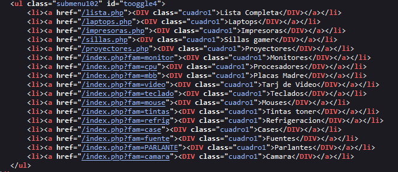

# Local File Inclusion (LFI) + Path Traversal 

El LFI ocurre cuando mediante un campo de entrada se está llamando a la ruta de un archivo local, lo cual permite la lectura de estos archivos. 


## Introducion

**Local File Inclusion:** Es una vulnerabilidad web que permite la lectura de archivos locales. Esta vulnerabilidad ocurre cuando mediante un campo de entrada  se está llamando a la ruta de un archivo local.

> URL = `localhost/?file=RUTA_LOCAL`

**Path Traversal:** Se enfoca en la manipulación de las rutas de archivos para acceder a recursos que normalmente no estar disponibles

> URL = `localhost/?file=/../../../../../../RUTA_LOCAL`


# Identifocacion de posible Vulneravilidad

Al inspecinar un codigo de una web, tenemos que verifcar si contiene las siguiente caracteristivas `index.php?fam=monitor`, lo cual nos indicaria una posible vulneravilidad de **LOCAL FILE INCLUSION**

```html
<li><a href="/index.php?fam=monitor"><DIV class="cuadro1">Monitores</DIV></a></li>
```




## Versiones de LFI

`=/etc/passwd:`
Accede al archivo /etc/passwd en el sistema. Este archivo generalmente contiene información sobre usuarios del sistema.

`=/var/www/html/etc/passwd:`
Intenta acceder al archivo /etc/passwd, pero especifica una ruta relativa que comienza desde el directorio /var/www/html/. Esto es común cuando el atacante intenta navegar hacia arriba en la estructura de directorios del servidor web.

`=/var/www/html/../../../../../../../../../../../../etc/hosts:`
Utiliza una ruta relativa para intentar acceder al archivo /etc/hosts navegando hacia arriba en la estructura de directorios desde el directorio /var/www/html/.

`=/var/www/html/….//….//….//….//….//….//….//….//….//….//….//….//etc/hosts:`
Similar al anterior, pero utilizando secuencias de puntos y barras diagonales (/) para navegar hacia arriba en la estructura de directorios.

`=/var/www/html/….//….//….//….//….//….//….//….//….//….//….//….//etc/hosts%00:`
Similar al cuarto, pero con un carácter de nulo %00 al final. Es un intento de vulnerabilidad específica que maneja las rutas de manera diferente cuando se encuentra un carácter de nulo.


## Reporte


